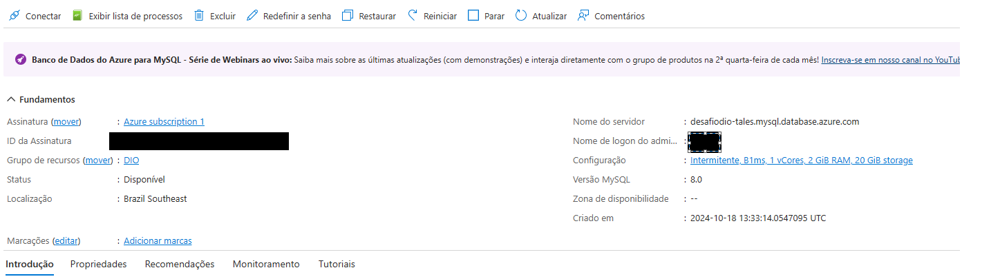
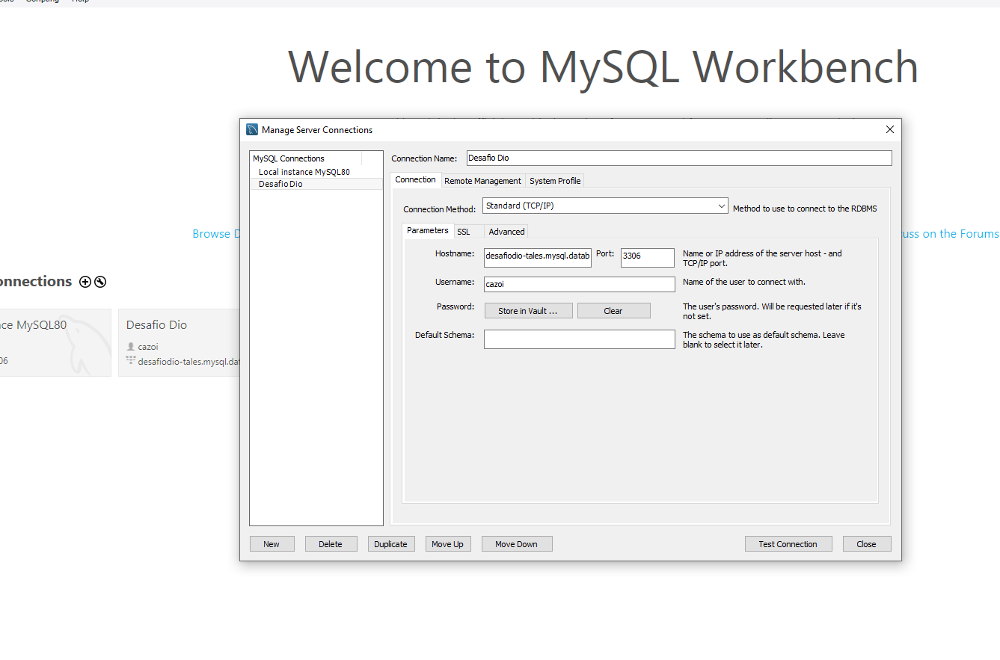
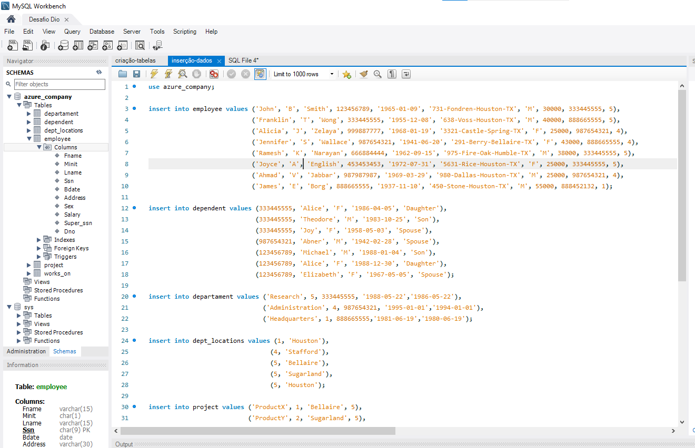
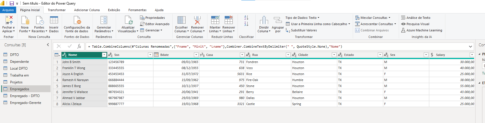
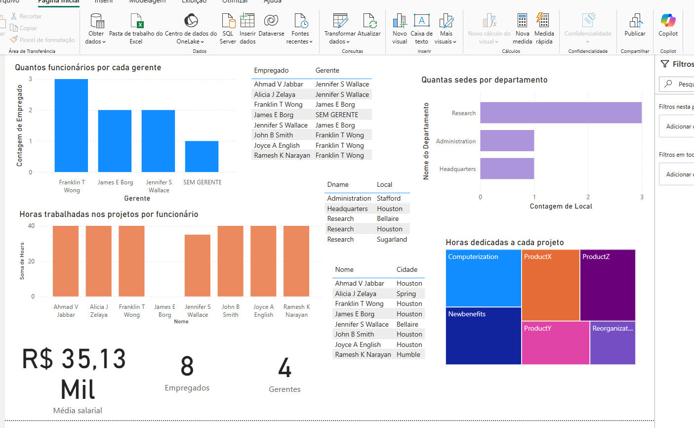
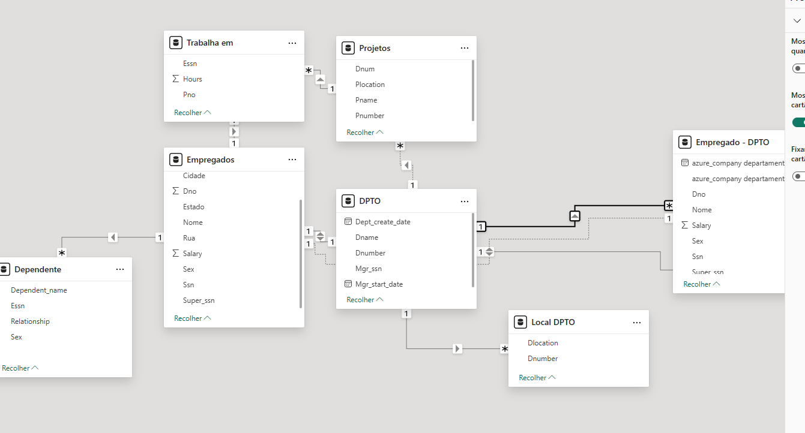

# Criando um Dashboard corporativo com integração com MySQL e Azure

Nossa solução sobre o desafio de transformação, extração e limpeza de dados do MySQL usando um DB instanciado no Azure.

Na parte de juntar funcionários e gerentes, usamos a seguinte query:

```
select concat(e1.fname, ' ' ,  e1.minit, ' ' ,e1.lname) as Empregado, e1.Ssn as SSN_Empregado, concat(e2.fname, ' ', e2.minit, ' ' ,e2.lname) as Gerente, e1.Super_ssn as SSN_Gerente from employee e1 left join employee e2 on e1.Super_ssn = e2.Ssn;
```

Tivemos que alterar os scripts para a criação das tabelas no MySQL porque estavam dando erro. Os arquivos modificados estão neste repositório.

Screenshots do projeto:

O DB rodando


Usando o MySQL Workbench para acessar o DB



Manipulando os dados no PowerBI





